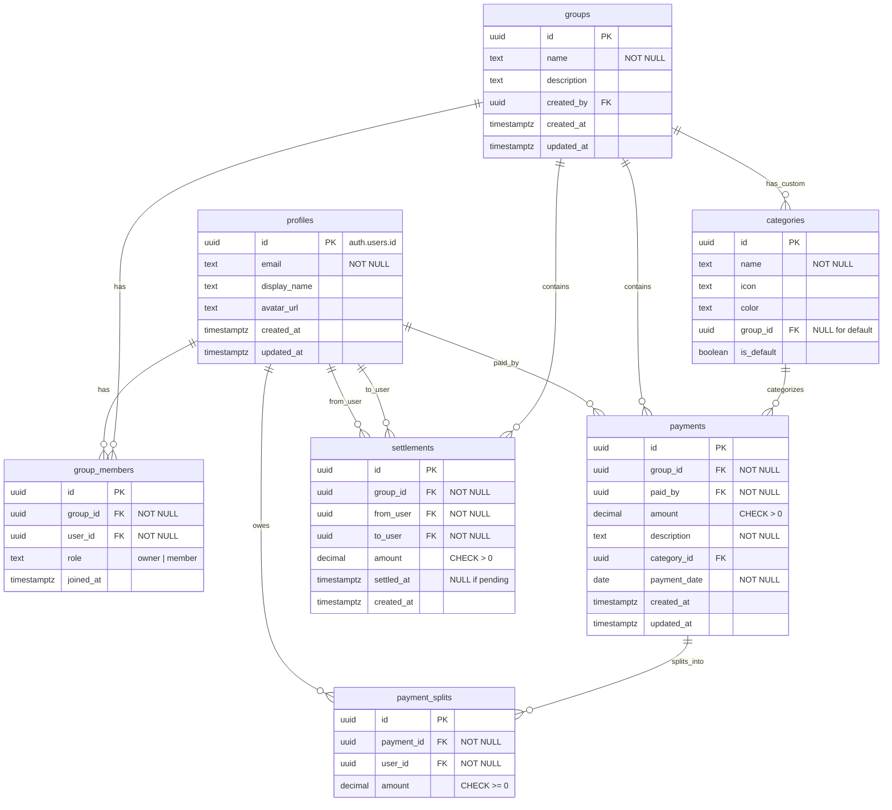

# Kakeibo Share - 設計書

## 1. プロジェクト概要

**Kakeibo Share** は、ルームシェアやパートナーと家計を共有し、清算処理を行うためのWebアプリケーションです。

### 目的
- 共同生活者間での支出の透明性確保
- 誰がいくら支払い、誰がいくら負担すべきかを明確化
- 清算金額の自動計算による手間削減
- 支出傾向の可視化による家計管理サポート

### 技術スタック
| カテゴリ | 技術 |
|---------|------|
| Frontend | Next.js 16 (App Router), TypeScript |
| Styling | Tailwind CSS v4 |
| Database | Supabase (PostgreSQL) |
| Auth | Supabase Auth |
| Package Manager | npm |

---

## 2. 機能一覧

### 2.1 認証機能

| 機能 | 状態 | 説明 |
|------|------|------|
| サインアップ | 実装済 | メールアドレスとパスワードでアカウント作成 |
| ログイン | 実装済 | メールアドレスとパスワードでログイン |
| ログアウト | 実装済 | セッション終了 |
| パスワードリセット | 未実装 | メールでリセットリンク送信 |
| プロフィール編集 | 未実装 | 表示名・アバター変更 |

### 2.2 グループ管理

| 機能 | 状態 | 説明 |
|------|------|------|
| グループ作成 | 実装済 | 新規グループを作成（作成者が owner） |
| グループ一覧表示 | 実装済 | 所属グループの一覧表示 |
| グループ詳細表示 | 実装済 | メンバー一覧、支払い履歴表示 |
| メンバー招待 | 実装済 | メールアドレスでメンバーを招待 |
| メンバー削除 | 未実装 | owner がメンバーを削除 |
| グループ編集 | 未実装 | グループ名・説明の編集 |
| グループ削除 | 未実装 | グループの削除（owner のみ） |
| グループ退会 | 未実装 | 自分でグループから退会 |

### 2.3 支出（支払い）登録

| 機能 | 状態 | 説明 |
|------|------|------|
| 支払い登録 | 実装済 | 金額、説明、カテゴリ、日付を登録 |
| 均等割り勘 | 実装済 | グループメンバー全員で均等に分割 |
| カスタム割り勘 | 実装済 | 各メンバーの負担額を個別設定 |
| カテゴリ選択 | 実装済 | デフォルトカテゴリから選択 |
| 支払い一覧表示 | 実装済 | グループ内の支払い履歴を表示 |
| 支払い編集 | 未実装 | 既存の支払いを編集 |
| 支払い削除 | 未実装 | 支払い記録を削除 |
| カスタムカテゴリ | 未実装 | グループ独自のカテゴリを追加 |

### 2.4 清算機能

| 機能 | 状態 | 説明 |
|------|------|------|
| 残高計算 | 実装済 | 各メンバーの収支バランスを計算 |
| 清算提案 | 実装済 | 誰が誰にいくら払うか自動計算 |
| 清算完了マーク | 未実装 | 清算が完了したことを記録 |
| 清算履歴 | 未実装 | 過去の清算記録を表示 |
| 一括清算 | 未実装 | 複数の清算を一度に完了 |

### 2.5 可視化・分析（グラフ表示）

| 機能 | 状態 | 説明 |
|------|------|------|
| カテゴリ別支出（円グラフ） | 未実装 | カテゴリごとの支出割合を円グラフで表示 |
| 月別支出推移（折れ線グラフ） | 未実装 | 月ごとの支出合計を折れ線グラフで表示 |
| メンバー別支出（棒グラフ） | 未実装 | メンバーごとの支出額を棒グラフで表示 |
| 期間フィルター | 未実装 | 表示期間を指定してフィルタリング |
| ダッシュボード統計 | 未実装 | 今月の支出合計、前月比などを表示 |

### 2.6 その他機能

| 機能 | 状態 | 説明 |
|------|------|------|
| 検索・フィルター | 未実装 | 支払いの検索、日付・カテゴリでフィルター |
| 通知機能 | 未実装 | 新規支払い、清算依頼の通知 |
| CSV エクスポート | 未実装 | 支払いデータを CSV でダウンロード |
| ダークモード | 未実装 | ダークテーマ対応 |

---

## 3. 画面一覧

```
/                     # トップページ（ランディング）
/login                # ログイン
/signup               # サインアップ
/dashboard            # ダッシュボード（認証必須）
/groups               # グループ一覧（認証必須）
/groups/new           # グループ作成（認証必須）
/groups/[id]          # グループ詳細（認証必須）
/groups/[id]/edit     # グループ編集（未実装）
/payments             # 支払い一覧（認証必須）
/payments/new         # 支払い登録（認証必須）
/payments/[id]        # 支払い詳細（未実装）
/payments/[id]/edit   # 支払い編集（未実装）
/settlement           # 清算（認証必須）
/analytics            # 分析・グラフ（未実装）
/settings             # 設定（未実装）
```

---

## 4. データベース設計

### 4.1 ER図



### 4.2 テーブル定義

#### profiles（ユーザープロフィール）

| カラム | 型 | 制約 | 説明 |
|--------|-----|------|------|
| id | UUID | PK, FK(auth.users) | ユーザーID |
| email | TEXT | NOT NULL | メールアドレス |
| display_name | TEXT | - | 表示名 |
| avatar_url | TEXT | - | アバター画像URL |
| created_at | TIMESTAMPTZ | DEFAULT NOW() | 作成日時 |
| updated_at | TIMESTAMPTZ | DEFAULT NOW() | 更新日時 |

**RLS ポリシー:**
- SELECT: 全ユーザーがすべてのプロフィールを閲覧可能
- UPDATE: 自分のプロフィールのみ更新可能

---

#### groups（グループ）

| カラム | 型 | 制約 | 説明 |
|--------|-----|------|------|
| id | UUID | PK, DEFAULT uuid_generate_v4() | グループID |
| name | TEXT | NOT NULL | グループ名 |
| description | TEXT | - | 説明 |
| created_by | UUID | FK(profiles) | 作成者 |
| created_at | TIMESTAMPTZ | DEFAULT NOW() | 作成日時 |
| updated_at | TIMESTAMPTZ | DEFAULT NOW() | 更新日時 |

**RLS ポリシー:**
- SELECT: 自分が所属するグループのみ閲覧可能
- INSERT: 認証済みユーザーが作成可能
- UPDATE: owner のみ更新可能
- DELETE: owner のみ削除可能

---

#### group_members（グループメンバー）

| カラム | 型 | 制約 | 説明 |
|--------|-----|------|------|
| id | UUID | PK, DEFAULT uuid_generate_v4() | レコードID |
| group_id | UUID | FK(groups), NOT NULL | グループID |
| user_id | UUID | FK(profiles), NOT NULL | ユーザーID |
| role | TEXT | CHECK(owner/member), DEFAULT 'member' | 役割 |
| joined_at | TIMESTAMPTZ | DEFAULT NOW() | 参加日時 |

**制約:**
- UNIQUE(group_id, user_id)

**RLS ポリシー:**
- SELECT: 同じグループのメンバーのみ閲覧可能
- INSERT: owner のみ追加可能（グループ作成時は自分を owner として追加可能）
- DELETE: owner または自分自身（退会）のみ削除可能

---

#### categories（カテゴリ）

| カラム | 型 | 制約 | 説明 |
|--------|-----|------|------|
| id | UUID | PK, DEFAULT uuid_generate_v4() | カテゴリID |
| name | TEXT | NOT NULL | カテゴリ名 |
| icon | TEXT | - | アイコン名 |
| color | TEXT | - | カラーコード |
| group_id | UUID | FK(groups), NULL | グループID（NULLはデフォルト） |
| is_default | BOOLEAN | DEFAULT false | デフォルトフラグ |

**デフォルトカテゴリ:**
- Food & Groceries
- Utilities
- Rent
- Internet & Phone
- Transportation
- Entertainment
- Healthcare
- Other

---

#### payments（支払い）

| カラム | 型 | 制約 | 説明 |
|--------|-----|------|------|
| id | UUID | PK, DEFAULT uuid_generate_v4() | 支払いID |
| group_id | UUID | FK(groups), NOT NULL | グループID |
| paid_by | UUID | FK(profiles), NOT NULL | 支払者 |
| amount | DECIMAL(12,2) | CHECK(> 0), NOT NULL | 金額 |
| description | TEXT | NOT NULL | 説明 |
| category_id | UUID | FK(categories) | カテゴリID |
| payment_date | DATE | NOT NULL | 支払い日 |
| created_at | TIMESTAMPTZ | DEFAULT NOW() | 作成日時 |
| updated_at | TIMESTAMPTZ | DEFAULT NOW() | 更新日時 |

**RLS ポリシー:**
- SELECT: 同じグループのメンバーのみ閲覧可能
- INSERT: グループメンバーのみ登録可能
- UPDATE: 支払者本人のみ更新可能
- DELETE: 支払者本人のみ削除可能

---

#### payment_splits（支払い分割）

| カラム | 型 | 制約 | 説明 |
|--------|-----|------|------|
| id | UUID | PK, DEFAULT uuid_generate_v4() | レコードID |
| payment_id | UUID | FK(payments), NOT NULL | 支払いID |
| user_id | UUID | FK(profiles), NOT NULL | 負担者 |
| amount | DECIMAL(12,2) | CHECK(>= 0), NOT NULL | 負担額 |

**制約:**
- UNIQUE(payment_id, user_id)

---

#### settlements（清算）

| カラム | 型 | 制約 | 説明 |
|--------|-----|------|------|
| id | UUID | PK, DEFAULT uuid_generate_v4() | 清算ID |
| group_id | UUID | FK(groups), NOT NULL | グループID |
| from_user | UUID | FK(profiles), NOT NULL | 支払い元 |
| to_user | UUID | FK(profiles), NOT NULL | 支払い先 |
| amount | DECIMAL(12,2) | CHECK(> 0), NOT NULL | 清算金額 |
| settled_at | TIMESTAMPTZ | NULL | 完了日時（NULLは未完了） |
| created_at | TIMESTAMPTZ | DEFAULT NOW() | 作成日時 |

---

### 4.3 ヘルパー関数

#### calculate_user_balance(group_id, user_id)

グループ内でのユーザーの残高を計算する関数。

```sql
RETURNS DECIMAL AS $$
  total_paid - total_owed
$$
```

- **total_paid**: ユーザーが支払った金額の合計
- **total_owed**: ユーザーが負担すべき金額の合計（payment_splits）
- **戻り値**: 正の値 = お金をもらえる、負の値 = お金を払う必要がある

---

## 5. 清算アルゴリズム

### 5.1 残高計算

各メンバーについて以下を計算：

```
残高 = 支払った金額の合計 - 負担すべき金額の合計
```

- **残高 > 0**: 他のメンバーからお金をもらう権利がある
- **残高 < 0**: 他のメンバーにお金を払う必要がある
- **残高 = 0**: 清算不要

### 5.2 最小清算回数アルゴリズム

清算回数を最小化するために、以下のアルゴリズムを使用：

1. メンバーを「債務者（残高 < 0）」と「債権者（残高 > 0）」に分類
2. 債務者を残高の昇順（負債が大きい順）でソート
3. 債権者を残高の降順（債権が大きい順）でソート
4. 債務者と債権者をマッチングし、清算額を決定
5. 残高が 0 になるまで繰り返し

**例:**
```
メンバー: A(+3000), B(-2000), C(-1000)
清算: B → A: ¥2000, C → A: ¥1000
```

---

## 6. セキュリティ設計

### 6.1 認証

- Supabase Auth を使用したメール/パスワード認証
- セッションは HTTP-only Cookie で管理
- 認証が必要なページは `(protected)` Route Group で保護

### 6.2 認可（Row Level Security）

すべてのテーブルで RLS を有効化し、以下を保証：

- ユーザーは自分が所属するグループのデータのみアクセス可能
- 支払いの編集・削除は支払者本人のみ可能
- グループの編集・削除は owner のみ可能

### 6.3 データ検証

- 金額は正の数値のみ（CHECK 制約）
- 必須フィールドは NOT NULL 制約
- 外部キー制約でデータ整合性を保証

---

## 7. 国際化（i18n）ルール

### 7.1 基本原則

**重要**: すべての表示テキストは辞書ファイルから定数を参照し、コードに直接記述してはならない。

```tsx
// Bad - ハードコーディング（禁止）
<h1>ダッシュボード</h1>
<button>支払いを追加</button>

// Good - 辞書ファイルから参照
import { t } from "@/lib/i18n";
<h1>{t("dashboard.title")}</h1>
<button>{t("payments.addPayment")}</button>
```

### 7.2 辞書ファイルの構成

| ファイル | 言語 | 説明 |
|----------|------|------|
| `src/locales/ja.json` | 日本語 | デフォルト言語 |
| `src/locales/en.json` | 英語 | 英語翻訳 |

### 7.3 辞書ファイルの構造

```json
{
  "common": {
    "appName": "Kakeibo Share",
    "loading": "読み込み中...",
    ...
  },
  "auth": {
    "login": {
      "title": "ログイン",
      ...
    }
  },
  "dashboard": { ... },
  "groups": { ... },
  "payments": { ... },
  "settlement": { ... },
  "navigation": { ... },
  "categories": { ... }
}
```

### 7.4 翻訳関数の使い方

```tsx
import { t } from "@/lib/i18n";

// 単純なテキスト
t("common.appName")  // "Kakeibo Share"

// パラメータ付き（動的な値）
t("groups.memberCount", { count: 5 })  // "5人のメンバー"
```

### 7.5 新規テキスト追加時のルール

1. まず `src/locales/ja.json` に日本語テキストを追加
2. 同時に `src/locales/en.json` に英語テキストを追加
3. 適切なネームスペースに配置（例: 認証関連は `auth.*`）
4. キー名は camelCase で記述
5. 動的な値は `{paramName}` 形式でプレースホルダーを使用

### 7.6 ハードコーディングが許容される例外

以下の場合のみ、コード内に直接テキストを記述可能：

- 数値・通貨記号（`¥`）
- 固有名詞（アプリ名など、ただし辞書に `common.appName` として定義推奨）
- 開発者向けのログメッセージ（`console.log`, `console.error` など）
- HTML 属性値（`placeholder` の例示値を除く）

---

## 8. 今後の拡張予定

### Phase 1（MVP強化）
- [ ] 支払い編集・削除機能
- [ ] 清算完了マーク機能
- [ ] パスワードリセット

### Phase 2（可視化）
- [ ] カテゴリ別支出円グラフ
- [ ] 月別支出推移折れ線グラフ
- [ ] ダッシュボード統計

### Phase 3（利便性向上）
- [ ] 検索・フィルター機能
- [ ] CSV エクスポート
- [ ] ダークモード

### Phase 4（発展機能）
- [ ] プッシュ通知
- [ ] 定期支払いの自動登録
- [x] 多言語対応（i18n 基盤構築済み）
