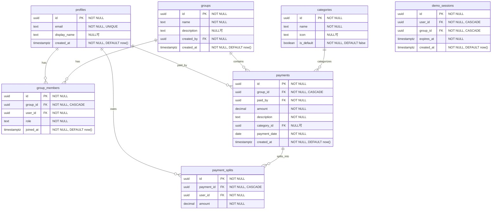

# Kakeibo Share - 設計書

## 1. プロジェクト概要

**Kakeibo Share** は、ルームシェアやパートナーと家計を共有し、清算処理を行うためのWebアプリケーションです。

### 目的

- 共同生活者間での支出の透明性確保
- 誰がいくら支払い、誰がいくら負担すべきかを明確化
- 清算金額の自動計算による手間削減

---

## 2. 機能一覧

### 認証機能

| 機能 | 説明 |
|------|------|
| サインアップ | メールアドレスとパスワードでアカウント作成 |
| ログイン | メールアドレスとパスワードでログイン |
| ログアウト | セッション終了 |

### グループ管理

| 機能 | 説明 |
|------|------|
| グループ作成 | 新規グループを作成（作成者が owner） |
| グループ一覧表示 | 所属グループの一覧表示 |
| グループ詳細表示 | メンバー一覧、支払い履歴表示 |
| メンバー招待 | メールアドレスでメンバーを招待 |

### 支出（支払い）登録

| 機能 | 説明 |
|------|------|
| 支払い登録 | 金額、説明、カテゴリ、日付を登録 |
| 均等割り勘 | グループメンバー全員で均等に分割 |
| カスタム割り勘 | 各メンバーの負担額を個別設定 |
| 支払い一覧表示 | グループ内の支払い履歴を表示 |

### 清算機能

| 機能 | 説明 |
|------|------|
| 残高計算 | 各メンバーの収支バランスを計算 |
| 清算提案 | 誰が誰にいくら払うか自動計算 |

---

## 3. バリデーション定義

### 支払い（payments）

| フィールド | ルール | エラーメッセージ |
|-----------|--------|-----------------|
| amount | 1 以上 | 「金額は1円以上で入力してください」 |
| amount | 1,000,000 以下 | 「金額は100万円以下で入力してください」 |
| amount | 整数のみ | 「金額は整数で入力してください」 |
| description | 1文字以上 | 「説明を入力してください」 |
| description | 100文字以下 | 「説明は100文字以内で入力してください」 |
| payment_date | 未来日付不可 | 「未来の日付は指定できません」 |
| payment_date | 1年以上前不可 | 「1年以上前の日付は指定できません」 |

### グループ（groups）

| フィールド | ルール | エラーメッセージ |
|-----------|--------|-----------------|
| name | 1文字以上 | 「グループ名を入力してください」 |
| name | 50文字以下 | 「グループ名は50文字以内で入力してください」 |
| description | 200文字以下 | 「説明は200文字以内で入力してください」 |
| メンバー数 | 20人以下 | 「グループのメンバーは20人までです」 |

### ユーザー（profiles）

| フィールド | ルール | エラーメッセージ |
|-----------|--------|-----------------|
| display_name | 30文字以下 | 「表示名は30文字以内で入力してください」 |
| email | 有効なメール形式 | 「有効なメールアドレスを入力してください」 |

### 割り勘（payment_splits）

| フィールド | ルール | エラーメッセージ |
|-----------|--------|-----------------|
| amount | 0 以上 | 「負担額は0円以上で入力してください」 |
| 合計 | 支払い金額と一致 | 「負担額の合計が支払い金額と一致しません」 |

---

## 4. 画面一覧

### ページ構成

```
/                     # トップページ（ランディング）
/login                # ログイン
/signup               # サインアップ
/groups               # グループ一覧 ※ログイン後のホーム画面
/groups/[id]          # グループ詳細（メイン操作画面）
```

### `/groups/[id]` に集約される機能

グループ詳細画面がアプリのメイン操作画面となり、以下の機能を集約：

| 機能 | UI形式 | 説明 |
|------|--------|------|
| 支払い登録 | インラインフォーム | 画面上部に常時表示、即座に入力可能 |
| 支払い履歴 | リスト表示 | グループ内の支払い一覧をスクロール表示 |
| 残高サマリー | カード表示 | 各メンバーの残高を簡易表示 |
| 清算詳細 | モーダル | 「清算する」ボタンで清算提案を表示 |
| グループ設定 | モーダル | メンバー招待・グループ編集 |

### モーダル一覧

| モーダル | 起動元 | 内容 |
|---------|--------|------|
| グループ作成 | `/groups` の「+」ボタン | 新規グループ作成フォーム |
| 清算詳細 | `/groups/[id]` の残高カード | 誰が誰にいくら払うか表示 |
| 支払い詳細 | 支払い履歴の各行タップ | 支払いの詳細・編集・削除 |
| メンバー招待 | グループ設定 | メールアドレスで招待 |

### 削除した画面（旧設計）

以下の画面は `/groups/[id]` に統合され、単独ページとしては不要：

- ~~`/dashboard`~~ → `/groups` がホーム画面を兼ねる
- ~~`/payments`~~ → `/groups/[id]` 内で支払い履歴を表示
- ~~`/payments/new`~~ → `/groups/[id]` 内のインラインフォーム
- ~~`/settlement`~~ → `/groups/[id]` 内の残高カード + モーダル

---

## 5. データベース設計

### ER図



### NULL 許容の厳格化

以下のフィールドは **NOT NULL** 必須です。アプリケーション層とDB層の両方でバリデーションを行います。

| テーブル | 必須フィールド（NOT NULL） | 任意フィールド（NULL可） |
|---------|--------------------------|------------------------|
| profiles | id, email, created_at | display_name, avatar_url |
| groups | id, name, created_by, created_at | description |
| group_members | id, group_id, user_id, role, joined_at | - |
| categories | id, name, is_default | icon, color, group_id |
| payments | id, group_id, paid_by, amount, description, payment_date, created_at | category_id |
| payment_splits | id, payment_id, user_id, amount | - |
| demo_sessions | id, user_id, group_id, expires_at, created_at | - |

### テーブル制約

#### profiles

```sql
id UUID PRIMARY KEY DEFAULT gen_random_uuid(),
email TEXT NOT NULL UNIQUE,
display_name TEXT CHECK (char_length(display_name) <= 30),
created_at TIMESTAMPTZ NOT NULL DEFAULT now()
```

#### groups

```sql
id UUID PRIMARY KEY DEFAULT gen_random_uuid(),
name TEXT NOT NULL CHECK (char_length(name) <= 50),
description TEXT CHECK (char_length(description) <= 200),
created_by UUID NOT NULL REFERENCES profiles(id),
created_at TIMESTAMPTZ NOT NULL DEFAULT now()
```

#### group_members

```sql
id UUID PRIMARY KEY DEFAULT gen_random_uuid(),
group_id UUID NOT NULL REFERENCES groups(id) ON DELETE CASCADE,
user_id UUID NOT NULL REFERENCES profiles(id),
role TEXT NOT NULL CHECK (role IN ('owner', 'member')),
joined_at TIMESTAMPTZ NOT NULL DEFAULT now(),
UNIQUE(group_id, user_id)
```

#### categories

```sql
id UUID PRIMARY KEY DEFAULT gen_random_uuid(),
name TEXT NOT NULL CHECK (char_length(name) <= 50),
icon TEXT,
is_default BOOLEAN NOT NULL DEFAULT false
```

#### payments

```sql
id UUID PRIMARY KEY DEFAULT gen_random_uuid(),
group_id UUID NOT NULL REFERENCES groups(id) ON DELETE CASCADE,
paid_by UUID NOT NULL REFERENCES profiles(id),
amount DECIMAL(12,2) NOT NULL CHECK (amount > 0 AND amount <= 1000000),
description TEXT NOT NULL CHECK (char_length(description) <= 100),
category_id UUID REFERENCES categories(id) ON DELETE SET NULL,
payment_date DATE NOT NULL CHECK (payment_date <= CURRENT_DATE),
created_at TIMESTAMPTZ NOT NULL DEFAULT now()
```

#### payment_splits

```sql
id UUID PRIMARY KEY DEFAULT gen_random_uuid(),
payment_id UUID NOT NULL REFERENCES payments(id) ON DELETE CASCADE,
user_id UUID NOT NULL REFERENCES profiles(id),
amount DECIMAL(12,2) NOT NULL CHECK (amount >= 0),
UNIQUE(payment_id, user_id)
```

#### demo_sessions

```sql
id UUID PRIMARY KEY DEFAULT gen_random_uuid(),
user_id UUID NOT NULL REFERENCES profiles(id) ON DELETE CASCADE,
group_id UUID NOT NULL REFERENCES groups(id) ON DELETE CASCADE,
expires_at TIMESTAMPTZ NOT NULL DEFAULT (now() + interval '24 hours'),
created_at TIMESTAMPTZ NOT NULL DEFAULT now()
```

### 削除時の挙動（Cascade）

**重要**: 親データ削除時に子データを自動削除することで、孤立データを防ぎます。

| 親テーブル | 子テーブル | 挙動 | 説明 |
|-----------|-----------|------|------|
| groups | group_members | CASCADE | グループ削除時 → 所属メンバー情報も削除 |
| groups | payments | CASCADE | グループ削除時 → 支払い履歴も削除 |
| groups | demo_sessions | CASCADE | グループ削除時 → デモセッションも削除 |
| payments | payment_splits | CASCADE | 支払い削除時 → 割り勘データも削除 |
| profiles | demo_sessions | CASCADE | ユーザー削除時 → デモセッションも削除 |
| categories | payments.category_id | SET NULL | カテゴリ削除時 → 支払いのカテゴリをNULLに |
| profiles | groups, payments など | 削除不可 | ユーザーは削除せず、退会時は論理削除を検討 |

**Cascade 削除の連鎖例:**
```
グループ削除
├── group_members → 全メンバー情報削除
├── payments → 全支払い削除
│   └── payment_splits → 全割り勘データ削除
└── demo_sessions → デモセッション削除
```

### RLSポリシー要約

| テーブル | SELECT | INSERT | UPDATE | DELETE |
|---------|--------|--------|--------|--------|
| profiles | 全員 | - | 本人のみ | - |
| groups | メンバーのみ | 認証済み | ownerのみ | ownerのみ |
| group_members | メンバーのみ | ownerのみ | - | owner/本人 |
| payments | メンバーのみ | メンバー | 支払者のみ | 支払者のみ |
| payment_splits | メンバーのみ | メンバー | - | - |

---

## 6. 清算アルゴリズム

### 残高計算

```
残高 = 支払った金額の合計 - 負担すべき金額の合計
```

- **残高 > 0**: 他のメンバーからお金をもらう権利がある
- **残高 < 0**: 他のメンバーにお金を払う必要がある

### 最小清算回数アルゴリズム

1. メンバーを「債務者（残高 < 0）」と「債権者（残高 > 0）」に分類
2. 債務者を残高の昇順（負債が大きい順）でソート
3. 債権者を残高の降順（債権が大きい順）でソート
4. 債務者と債権者をマッチングし、清算額を決定
5. 残高が 0 になるまで繰り返し

**例:**
```
メンバー: A(+3000), B(-2000), C(-1000)
清算: B → A: ¥2000, C → A: ¥1000
```

---

## 7. 国際化（i18n）

### 基本ルール

すべての表示テキストは辞書ファイルから参照する。

```tsx
import { t } from "@/lib/i18n";

// Good
<h1>{t("dashboard.title")}</h1>
<span>{t("common.currency")}{amount}</span>

// Bad - ハードコーディング禁止
<h1>ダッシュボード</h1>
<span>¥{amount}</span>
```

### 辞書ファイル

| ファイル | 言語 |
|----------|------|
| `src/locales/ja.json` | 日本語（デフォルト） |
| `src/locales/en.json` | 英語 |

### キー命名規則

- ネームスペース: `auth`, `dashboard`, `groups`, `payments`, `settlement`, `common`, `navigation`
- キー名: camelCase
- パラメータ: `{paramName}` 形式

```tsx
t("groups.memberCount", { count: 5 })  // "5人のメンバー"
```

---

## 8. セキュリティ設計

### 認証

- Supabase Auth によるメール/パスワード認証
- セッションは HTTP-only Cookie で管理
- 認証必須ページは `(protected)` Route Group で保護

### 認可

- すべてのテーブルで RLS を有効化
- ユーザーは自分が所属するグループのデータのみアクセス可能
- 支払いの編集・削除は支払者本人のみ
- グループの編集・削除は owner のみ
